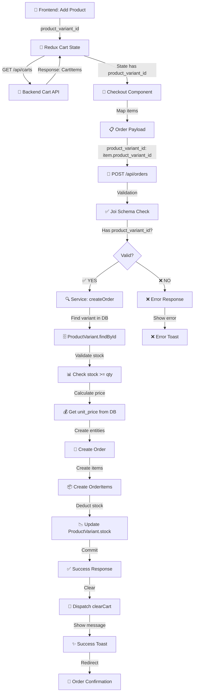

# ✅ CHECKOUT FIX - FINAL IMPLEMENTATION CHECKLIST

## 📋 What Was Done

### Backend Fixes (✅ COMPLETED)

#### 1. Enhanced Validation Schema
**File:** `src/validations/productValidation.js`
- ✅ Changed to use `.external()` validator for explicit product_variant_id/product_id check
- ✅ Made `unit_price` and `subtotal` truly optional
- ✅ Added clear error messages in Vietnamese
- ✅ Better error detection - tells user which fields are missing

**Before:**
```javascript
.or('product_variant_id', 'product_id').required()  // Ambiguous
```

**After:**
```javascript
.external(async (value) => {
  if (!value.product_variant_id && !value.product_id) {
    throw new Error('...');
  }
})  // Clear and explicit
```

#### 2. Improved Error Handling
**File:** `src/middlewares/validateMiddleware.js`
- ✅ Added debug info in development mode
- ✅ Added helpful hints for missing product ID
- ✅ Logs validation errors to console
- ✅ Shows received fields structure for debugging

**New Features:**
- 💡 Helpful emoji hints in error messages
- 🔍 Debug mode shows what fields were received
- 📊 Log shows exact payload structure received

#### 3. Robust Order Service
**File:** `src/services/orderService.js`
- ✅ Validates each item thoroughly
- ✅ Auto-finds variant if only product_id sent
- ✅ Auto-calculates unit_price from database
- ✅ Auto-calculates subtotal from qty × price
- ✅ Deducts stock in transaction
- ✅ Rollback on any error (transaction safety)

---

## 📊 Complete Data Model Unification

### CartItem → OrderItem Mapping

| Field | CartItem | OrderItem | Frontend | Notes |
|-------|----------|-----------|----------|-------|
| `id` | CartItem.id | N/A | Not used | Cart item's own ID |
| `product_variant_id` | ✅ YES | ✅ YES | ✅ YES | **KEY FIELD** |
| `product_id` | NO | NO | Optional | Fall back only |
| `quantity` | ✅ YES | ✅ YES | ✅ YES | Must be > 0 |
| `unit_price` | ✅ YES | ✅ YES | Optional | Backend calculates if missing |
| `subtotal` | ✅ YES | ✅ YES | Optional | Backend calculates if missing |
| `size` | CartItem.variant.size | N/A | For display | Not stored in order_items |
| `color` | CartItem.variant.color | N/A | For display | Not stored in order_items |

---

## 🎯 Frontend Implementation Guide

### Files Frontend Developer Must Check/Update

```
Frontend Project/
├── src/
│   ├── store/
│   │   ├── slices/
│   │   │   └── cartSlice.js          ← CHECK: How cart items are stored
│   │   └── index.js
│   ├── services/
│   │   ├── api.js                    ← CHECK: API endpoints
│   │   ├── cartService.js            ← CHECK: Cart loading logic
│   │   └── orderService.js           ← UPDATE: Order payload creation
│   ├── pages/
│   │   ├── Checkout.js               ← UPDATE: Payload mapping
│   │   └── Cart.js
│   └── App.js
```

### Step-by-Step Frontend Fix

#### Step 1: Verify Cart Loading

**Location:** Redux slice or cart service

**Check:**
```javascript
// When fetching from API
const response = await fetch('/api/carts', headers);
const data = response.json();

// DO NOT DO THIS (❌ filters out product_variant_id):
const items = data.items.map(i => ({
  id: i.id,
  quantity: i.quantity
}));

// DO THIS (✅ preserves all fields):
const items = data.items;  // OR map all fields including product_variant_id
```

#### Step 2: Update Redux/State Storage

**Ensure Redux stores cart items with:**
```javascript
{
  id: 123,
  product_variant_id: 5,        // ✅ MUST HAVE
  quantity: 1,
  unit_price: 100000,
  subtotal: 100000,
  variant: {
    size: 'L',
    color: 'Red'
  }
}
```

#### Step 3: Fix Checkout Component

**Current (❌ Wrong):**
```javascript
const payload = {
  items: cartItems.map(item => ({
    product_id: item.id,  // ❌ WRONG
    quantity: item.quantity
  }))
}
```

**Fixed (✅ Correct):**
```javascript
const payload = {
  receiver_name: formData.receiver_name.trim(),
  phone: formData.phone.trim(),
  shipping_address: formData.shipping_address.trim(),
  payment_method: paymentMethod.toUpperCase(),
  items: cartItems
    .filter(item => item.product_variant_id)  // ✅ Filter
    .map(item => ({
      product_variant_id: item.product_variant_id,  // ✅ CORRECT
      quantity: item.quantity
      // Optional - backend calculates:
      // unit_price: item.unit_price,
      // subtotal: item.subtotal
    }))
}
```

#### Step 4: Add Debug Logging

```javascript
const handlePlaceOrder = async (e) => {
  e.preventDefault();
  
  // 🔍 DEBUG
  console.log('📦 Cart state:', cartItems);
  console.log('📋 Payload:', JSON.stringify(payload, null, 2));
  
  // Validate before sending
  if (!payload.items?.length) {
    toast.error('Giỏ hàng được trống!');
    return;
  }
  
  const validItems = payload.items.filter(i => i.product_variant_id);
  if (validItems.length !== payload.items.length) {
    toast.error('Một số sản phẩm thiếu thông tin!');
    return;
  }
  
  // Send to API
  // ...
}
```

#### Step 5: Update Error Handling

**Current (shows technical errors):**
```javascript
catch (error) {
  toast.error(error.response?.data?.errors?.[0]);
}
```

**Better (user-friendly):**
```javascript
catch (error) {
  const apiErrors = error.response?.data?.errors || [];
  
  // Map technical errors to friendly messages
  let friendlyMessage = 'Đặt hàng không thành công. Vui lòng thử lại.';
  
  if (apiErrors.some(e => e.includes('product_variant_id'))) {
    friendlyMessage = 'Dữ liệu sản phẩm không hợp lệ. Vui lòng kiểm tra lại giỏ hàng.';
  } else if (apiErrors.some(e => e.includes('stock'))) {
    friendlyMessage = 'Một số sản phẩm không đủ tồn kho.';
  } else if (apiErrors.some(e => e.includes('không tồn tại'))) {
    friendlyMessage = 'Một số sản phẩm đã bị xóa khỏi hệ thống.';
  }
  
  toast.error(friendlyMessage);
}
```

---

## 🧪 Testing Plan

### Test 1: Verify Cart Structure
```javascript
// In browser console after adding items to cart
console.log(store.getState().cart.items[0]);
// Should show: id, product_variant_id, quantity, unit_price, subtotal
```
**Expected:** ✅ All fields present

### Test 2: Check Payload
```javascript
// In checkout component before sending
console.log('Payload:', payload);
```
**Expected:** ✅ items include `product_variant_id`

### Test 3: Postman API Test
```
POST http://localhost:5000/api/orders
Headers: Authorization: Bearer TOKEN

Body:
{
  "receiver_name": "Test",
  "phone": "0901234567",
  "shipping_address": "TP.HCM",
  "payment_method": "COD",
  "items": [{"product_variant_id": 5, "quantity": 1}]
}
```
**Expected:** ✅ 201 Created with order data

### Test 4: Database Check
```sql
-- Verify order
SELECT * FROM orders WHERE user_id = ? ORDER BY created_at DESC LIMIT 1;

-- Verify order items
SELECT * FROM order_items WHERE order_id = ?;

-- Verify stock decremented
SELECT stock FROM product_variants WHERE id = 5;
```
**Expected:** ✅ Order created, items inserted, stock decreased

### Test 5: End-to-End Flow
1. Add product to cart → Check Redux has `product_variant_id`
2. Go to checkout → Check payload has `product_variant_id`
3. Place order → Check response is success
4. Verify in database
5. Check order appears in "My Orders"

**Expected:** ✅ All 5 steps pass

---

## 🔄 Complete Data Flow



---

## 📱 Frontend Checkout Component - Complete Example

```javascript
import React, { useState } from 'react'
import { useSelector, useDispatch } from 'react-redux'
import { clearCart } from '../store/slices/cartSlice'
import toast from 'react-hot-toast'

const Checkout = () => {
  const { items: cartItems } = useSelector(state => state.cart)
  const dispatch = useDispatch()
  const [loading, setLoading] = useState(false)
  const [formData, setFormData] = useState({
    receiver_name: '',
    phone: '',
    shipping_address: ''
  })

  const handlePlaceOrder = async (e) => {
    e.preventDefault()
    
    if (cartItems.length === 0) {
      toast.error('Giỏ hàng trống!')
      return
    }

    // 🔍 DEBUG: Verify cart items
    console.log('📦 Cart Items:', cartItems)
    console.log('First item:', cartItems[0])

    // ✅ Build payload
    const payload = {
      receiver_name: formData.receiver_name.trim(),
      phone: formData.phone.trim(),
      shipping_address: formData.shipping_address.trim(),
      payment_method: 'COD',
      items: cartItems
        .filter(item => item.product_variant_id)  // ✅ Filter
        .map(item => ({
          product_variant_id: item.product_variant_id,  // ✅ KEY FIELD
          quantity: item.quantity
        }))
    }

    // 🔍 DEBUG: Check payload
    console.log('📋 Payload being sent:', JSON.stringify(payload, null, 2))

    // ✅ Validate items
    if (payload.items.length === 0) {
      toast.error('Những sản phẩm trong giỏ không có dữ liệu hợp lệ!')
      return
    }

    setLoading(true)
    try {
      const response = await fetch('/api/orders', {
        method: 'POST',
        headers: {
          'Authorization': `Bearer ${localStorage.getItem('token')}`,
          'Content-Type': 'application/json'
        },
        body: JSON.stringify(payload)
      })

      const data = await response.json()

      if (response.ok) {
        // ✅ Success
        dispatch(clearCart())
        toast.success('Đặt hàng thành công!', { duration: 5000 })
        // Redirect to order page or confirmation
      } else {
        // ❌ Validation error
        console.error('Error:', data.errors)
        
        // Show friendly error
        if (data.errors?.some(e => e.includes('product_variant_id'))) {
          toast.error('Dữ liệu sản phẩm không hợp lệ. Kiểm tra lại giỏ hàng.')
        } else {
          toast.error(data.errors?.[0] || 'Đặt hàng không thành công')
        }
      }
    } catch (error) {
      console.error('Checkout error:', error)
      toast.error('Lỗi kết nối. Vui lòng thử lại.')
    } finally {
      setLoading(false)
    }
  }

  return (
    <form onSubmit={handlePlaceOrder}>
      {/* Form fields */}
      <input
        name="receiver_name"
        value={formData.receiver_name}
        onChange={(e) => setFormData({...formData, receiver_name: e.target.value})}
        required
      />
      {/* ... other fields ... */}
      
      <button type="submit" disabled={loading}>
        {loading ? 'Đang đặt hàng...' : 'Đặt hàng'}
      </button>
    </form>
  )
}

export default Checkout
```

---

## 📚 Documentation Files Created

1. **CHECKOUT_COMPLETE_FIX.md**
   - Comprehensive guide with examples
   - Common issues & solutions
   - Postman test cases
   - cURL commands

2. **CHECKOUT_FLOW_COMPLETE_SUMMARY.md**
   - Executive summary
   - Complete data flow chart
   - Validation rules table
   - Troubleshooting guide
   - Quick reference payloads

3. **CHECKOUT_TEST_CASES_COMPREHENSIVE.js**
   - 10 complete test cases
   - Valid and invalid payloads
   - cURL commands
   - JavaScript fetch examples
   - Postman collection JSON

4. **CHECKOUT_QUICK_DIAGNOSTIC.js**
   - Browser console diagnostics
   - Cart structure inspector
   - Payload validator
   - API test function
   - Issue identifier

5. **CHECKOUT_FIX_CHECKLIST.md** (this file)
   - Implementation summary
   - Frontend fix steps
   - Testing plan
   - Example code

---

## ✅ Pre-Deployment Verification

- [ ] **Frontend:**
  - [ ] Cart items include `product_variant_id`
  - [ ] Checkout payload uses `product_variant_id`
  - [ ] Error messages are user-friendly
  - [ ] Test with minimal payload
  - [ ] Test with full payload
  - [ ] Test error cases

- [ ] **Backend:**
  - [ ] `src/validations/productValidation.js` updated
  - [ ] `src/middlewares/validateMiddleware.js` updated
  - [ ] `src/services/orderService.js` has transaction
  - [ ] Error messages in Vietnamese
  - [ ] Debug logging in place

- [ ] **Database:**
  - [ ] Order created after checkout
  - [ ] Order items inserted
  - [ ] Stock decremented correctly
  - [ ] Cart cleared after order

- [ ] **Testing:**
  - [ ] Test with Postman (minimal payload)
  - [ ] Test with Postman (full payload)
  - [ ] Test error cases
  - [ ] Test end-to-end flow
  - [ ] Verify all data in database

---

## 🚀 Deployment Steps

1. **Update Backend Code**
   - Deploy validation schema changes
   - Deploy middleware changes
   - Deploy error message improvements

2. **Update Frontend Code**
   - Update checkout component
   - Update cart loading logic
   - Test payloads before deploying

3. **Test Everything**
   - Use diagnostic tools
   - Run through all test cases
   - Verify database records

4. **Monitor**
   - Check backend logs for errors
   - Monitor checkout success rate
   - Alert if validation errors spike

---

## 📞 Support & Debugging

**If order creation still fails:**

1. Run diagnostic in browser console:
   ```javascript
   > RUN_FULL_DIAGNOSTIC('your_token')
   ```

2. Check Backend logs for validation errors

3. Verify in Database:
   ```sql
   SELECT * FROM orders LIMIT 5;
   SELECT * FROM order_items WHERE order_id = ?;
   ```

4. Check Network tab in DevTools:
   - Post request body
   - Response errors
   - Status codes

5. Common issues:
   - Missing `product_variant_id` in frontend
   - Renamed fields during transformation
   - Invalid token
   - Wrong endpoint URL
   - Variant doesn't exist

---

## 🎉 Success Criteria

After implementation, verify:
- ✅ Clicking "Đặt hàng" creates order without validation error
- ✅ Order appears with status "PENDING"
- ✅ OrderItems created with correct variant IDs
- ✅ Stock decremented from ProductVariant
- ✅ Order visible in "My Orders"
- ✅ Success message shown to user
- ✅ Cart cleared after order

---

**Status:** ✅ READY FOR IMPLEMENTATION  
**Last Updated:** April 6, 2026  
**Backend Changes:** ✅ COMPLETE  
**Frontend Changes:** ⏳ PENDING (Follow guide above)
